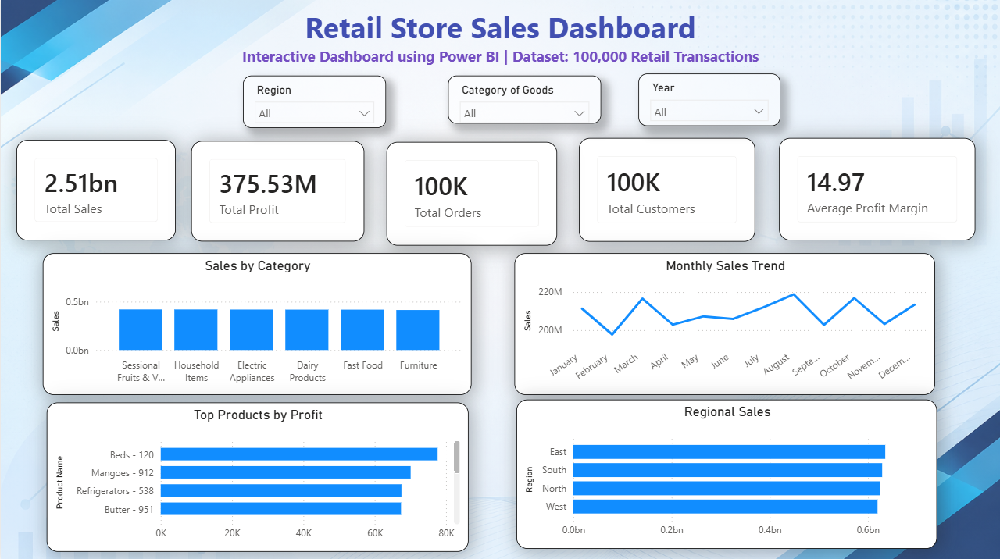

# Retail Store Sales Dashboard – Power BI

## 📊 Project Overview

An interactive Power BI dashboard developed to analyze 100,000 retail transactions and provide insights into sales, profit, products, customers, categories, and regional performance.

## 🎯 Objectives

- Analyze overall sales and profitability
- Identify top-performing products
- Compare sales across regions
- Analyze monthly sales trends
- Compare sales across product categories
- Track important business KPIs

## 📈 Dashboard KPIs

- Total Sales: 2.51B
- Total Profit: 375.53M
- Total Orders: 100K
- Total Customers: 100K
- Average Profit Margin: 14.97

## 📌 Dashboard Features

- Interactive Region filter
- Interactive Category filter
- Interactive Year filter
- Sales by Category
- Monthly Sales Trend
- Top Products by Profit
- Regional Sales Analysis
- KPI cards

## 🛠️ Tools Used

- Power BI
- SQL
- Excel
- Data Analysis

  ## 💡 Skills Demonstrated

- Data Cleaning & Transformation
- Exploratory Data Analysis (EDA)
- SQL
- Power BI Dashboard Development
- Data Visualization
- KPI Analysis
- Business Insight Generation

## 📂 Dataset
The dataset contains 100,000 retail transactions and 25 columns.

Source: Kaggle  
License: CC0: Public Domain

## 🖼️ Dashboard Preview

## 📁 Project Files

- `Retail_Store_Sales_Dashboard.pbix` – Power BI dashboard
- `dashboard.png` – Dashboard preview

  ## 📌 Key Insights

- Analyzed 100,000 retail transactions.
- Compared sales performance across regions and product categories.
- Identified top-performing products based on profit.
- Analyzed monthly sales trends.
- Built interactive filters for Region, Category, and Year.
